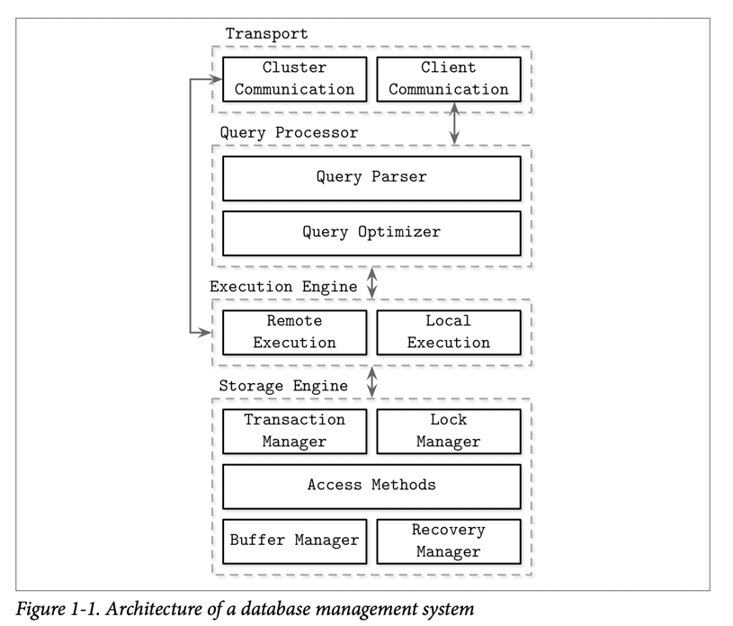
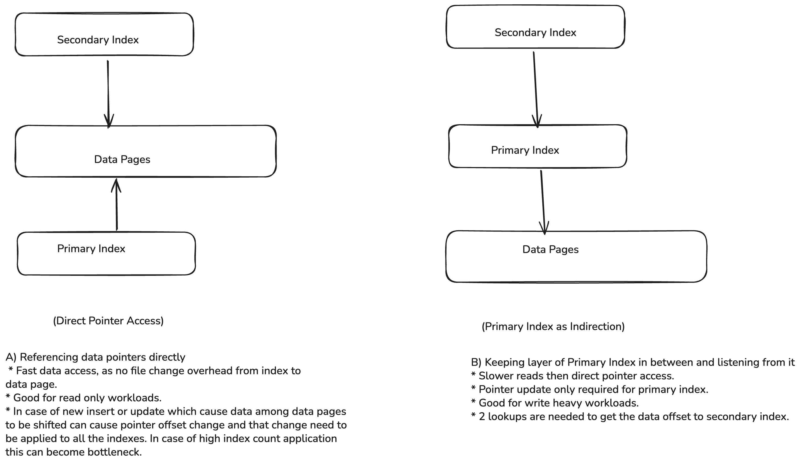

# Introduction and Overview 

Databases can serve different purposes: temporary hot data, long-lived cold data, complex analytical queries, accessing only key based, optimized to stored time-series data, and some for blob storage optimization. 

Major Categories of DBMS are: 

1. **Online transaction processing (OLTP) databases**: large number of request, mainly transactions, short-lived. 
2. **Online analytical processing (OLAP) databases**: analytics, data ware-housing, long-running queries. 
3. **Hybrid transactional and analytical processing (HTAP)**: OLAP + OLTP 

## DBMS Architecture
* Client: the application instance which request database for the query 
* Server: the actual database server which understands the query and retrieve the data. 

Basic Request flow: Client request comes in form of DDL query eg. via TCP, transport systems hand it over to query processor which parse, interpret and validate the query. Now the query is passed to query optimizer which removes the redundant part and optimizes the query to run is most efficient way possible. The final query till this state is represented as query plan execution. Execution engine handles this plan and exectues local or remote operations. 

* Remote operations involves writing/reading from some other nodes in cluster or replication
* Local operations involves writing/reading from local disk executed by storage engines.
* Local Execution (LLM Def): The part of the query plan that operates on data residing on the machine that is coordinating the query.
* Remote Execution(LLM Def): The process of sending sub-queries or data requests to other nodes in the cluster and waiting for their results. The coordinating node is essentially "calling another instance" to do work on its behalf.

(see [1]) in `README.md`
#### Components of storage engine:
1. Transaction Manager: schedules transactions and make sure data is not in inconsistent state.
2. Lock Manager: Ensure locks on database objects while doing concurrent transactions.
3. Access Methods: It includes the storage structure that is getting used: in memory heap, BTrees, LSM Trees etc.
4. Buffer Manager: Caches pages in memory
5. Recovery Manager: manages logs to recover from system failure i.e WAL

## Memory vs Disk Based DBMS 

* Memory based involves read-write via main memory and data resides on main memory itself. 
* Disk Based involves read-write via disk but also involves main-meomory to cache the pages from disk for operations. 

In memory are preferred for performance, low access cost. Programming for in-memory is also easy in contrast to disk based which involves managing data references, serialization, freed and free memory manually. 

Main memory based are volatile and we loose data if server crashes or restart, there are ways to maintain the data using un-interrupted power supply, battery backedup RAMS, but this all comes as a cost. Whereas disk based gives us durability and have lower cost factor. 

### Durability in Memory-Based Stores 
* They mainly keep their backup on the disk in case of system failure via log files. These log files can be replayed to restore the data in memory. Before data gets to the memory it gets written to that sequential append only log file and then to the memory. 
* In order to replay the log files every time a snapshot at a time of backup is kept on disk via batch. The log files can be applied to these batches time to time once done these log files can be discarded and data will be available upto a certain point in time. This process is called **_checkpointing_**. 
* Even though everything is on cache, we don't need serialization, data layout overhead.

## Column - Versus Row-Oriented DBMS
One way to classify the databases is by how the data is stored in disk: row-wise (**PostgreSQL**) or column wise(**Cassandra**). So in simple words if it's row wise storage, data is partitioned on the basis of rows (row means covering all fields for a ID), if data is partitioned on columns then it's column based (column with same field and it's data type). 

### Row-Oriented Data Layout
Data fields related to single userId will be fetched in a single go and will be stored collectively, like when written on a page they will be written will all fields available for that row. It is helps when we need full user details, and improves spatial locality. But this can become expensive in case when you have 50 fields and you just want to fetch all the phoneNumbers of users. In that case as we need to fetch the full row from the page this operation becomes more expensive and column databases may sound better for this use-case. 

### Column - Oriented Data Layout
* Stored in column, so instead of storing all stock(equity) info as row into a page, it stores the stock prices for all days into a column and store that column as a single fetch. Each price will have a key which helps to which master key this price belongs too. If you notice that's a overhead which comes up with the column layout. To reconstruct the data for a single stock detail, we may need to do joins filtering all that. Some databases use virtual key as identifier for the column data. 
* Many other column oriented format which boost the analytical query are: Apache Parquet, ORC, Kudu and some columnar databases such as ClickHouse. 

### Distinction and Optimizations 
* Choosing data layout is not only way to distinct between row and column dbs, it's just one step 
* Vectorized processing (SIMD on chunks of data), by columnar DBs 
* Storing values with same types, like **storing same types of column data together provides better compression ratio** 
* You need to understand the access pattern of your request, if you're fetching the whole detail(User Profile) for a ID or interest in just that one column value moslty (Stock prices).

### Wide Column Stores 
* It's not same as Column stores. 
* Represented as a multidimensional map, columns are grouped into column families and inside each family data is stored row wise, so they are not pure column based. 
* This suits best for the case when we're fetching the data on the basis of keys. 
* Hbase, BigTable. 
* MongoDb don't comes under this cateogy, MongoDB is a doument store. 

## Data Files and Index Files
* One can directly store the data on simple files over disk, why to use specialized file organization over flat file: Storage efficiency, Access efficiency, Update Efficiency. 
* Data Files: Used to store the actual data. 
* Index Files: Used to store the metadata and use it to locate the actual record in data files. 
* Index Files are smaller than Data files due to obvious reasons. Files are partitioned into pages and can be organized as sequence or records or slotted pages. 
* Most modern DBs don't delete the data from the file instead they mark them as tombstone and later gets cleared via garbage collection. 

### Data Files
For storing the data, the file organization have following types: 
1. **Heap Files (Heap-Organized Tables)**: No particular order, append anywhere in space, need a index which points to the record location. 
2. **Hashed Files (Hash-Organized Tables)**: Bucket based storage, key decides to which index the record is there. Inside a bucket record can be stored in order or sorted way (LinkedHashMap, TreeMap)
3. **Index-Organized Tables (IOTs, Index is the data)**: Data is stored inside the index itself, in sorted order of the key. Search is faster in this case as we get the key inside our index we have the data also there so no new lookup to a new file. 
### Index Files
* When you do index on a primary data file itself then it's a **_primary index_**. They can be assumed to be build over your primary key and all other indexes which do not use the primary key are secondary indexes. 
* Secondary index can simply store the pointer of the record or simply store it's primary key to find it. 
* We can have multiple secondary index for a record, it's pretty obvious by making index for multiple columns they will be stored in separate index files. 
* In case of primary index for a single key you'll have a single record, but in case of secondary index you can have multiple records per search key due to low Cardinality values i.e less variation in data eg. city of user, many user can come under a city. 
* Clustered Index: Order of the data records follows the search key order. 

| **Index Type**          | **Definition**                                                                   | **Physical Data Storage**                              | **Uniqueness**                            | **Relation with Table**                       | **Example**                                              |
| ----------------------- | -------------------------------------------------------------------------------- | ------------------------------------------------------ | ----------------------------------------- | --------------------------------------------- | -------------------------------------------------------- |
| **Primary Index**       | Index created on the **primary key** column(s).                                  | Usually **clustered** (depends on DBMS).               | Always **unique**                         | Tied to the primary key.                      | `PRIMARY KEY(id)` automatically creates a primary index. |
| **Clustered Index**     | Index where the **table rows are stored in the order of the index key**.         | **Data is the index** (only one per table).            | Doesn’t need to be unique (but often is). | Defines the **physical order** of table rows. | In InnoDB: primary key is the clustered index.           |
| **Non-Clustered Index** | Separate structure pointing to actual data row (via row ID/pointer).             | **Data is separate** from the index. Multiple allowed. | Can be unique or non-unique.              | Works like a **lookup table** to rows.        | `CREATE INDEX idx_name ON table(col)`                    |
| **Secondary Index**     | Any index that is **not the primary index**. Often implemented as non-clustered. | Usually a **non-clustered** index.                     | Can be unique or not.                     | Helps query performance on non-PK columns.    | In InnoDB: an index on `email` when PK is `id`.          |
In many DBs:
* Primary Key = Clustered Index
* Secondary Index = Non-Clustered Index

>Index-organized tables store information in index order and are
clustered by definition. Primary indexes are most often clustered.
Secondary indexes are nonclustered by definition, since they’re
used to facilitate access by keys other than the primary one. Clus‐
tered indexes can be both index-organized or have separate index
and data files.

* In case when there is no implicit primary key, storage engine automatically adds a new auto-increment key and fill in it's values automatically. InnoDB of MySQL implements this. 
### Primary Index as Indirection (Primary indirection means data on index)
* There is a different opinion or trade-off on whether data records should be refferenced directy with their file offsets or via primary key index, this is for the secondary index we create. Question is from where the secondary index should do look up, via direct offset of the data or via primary key. 
* Direct reference reduces the number of disk seeks, but needs to pay a cost of updating the pointers whenever the record is updated or relocated. So when ever there is update in data or new data is inserted the data can be moved to the new pages so we need to change the offset of the data for this reason. For this we need to update the pointer reference along all the indexes. So if we are using let say 10 indexes and doing direct lookup to offset then in that case we need to update all the indexes and if we use Primary Index as Indirection then there is only primary index looking to the offset and any change in the offset will only need to be updated to primary index as all other secondary indexes are looking to the primary index for the offset, this cause two way trip for lookup (one to primary then to offset). 
* Using primary index as indirection  (keeping offset and secondary index separate via primary index in between) reduce cost of pointer updates but has higher cost on a read path. 
* If workload is ready heavy Direct Pointers might work well, but if it's write heavy this approach might not work well and better to use Primary Index as Indirection. 

* In general, we can not tune this as this is at Architecture Level decision by databases.

## Buffering, Immutability, and Ordering
Storage engine based on some data structure, do not describe the semantics of caching, transaction, recovery etc. and we need to take care of them. Optimization in such storage structures can be done with following three concepts: 
#### 1. Buffering 
* A database uses a piece of fast memory (RAM) as a "buffer" to avoid doing lots of small, inefficient disk writes.
* Pain point is that writing each small change to disk is very expensive, better to store that all into a buffer, once buffer gets full dump all to disk in a single sequential call, this can dramatically increase the throughput. 
* This is kind of lazy BTree 
* If you see LSM Tree, whole concept of LSM trees are based on such buffer. There is a memtable (which is in-memory buffer) which stores the keys in sorted way and once mem-table is full it dumps the data to subsequent SSTable.

#### 2. Immutability
* **Append-Only**: To "update" a record, the database simply appends the new version of the record to the end of its current data file (the log). The old version still exists but is now considered stale.

* **Copy-on-Write (CoW)**:The database reads the page with the old record, makes the change in memory, but then writes this modified page to a brand new, empty location on the disk. It then updates the pointers that used to point to the old page to now point to the new one. The old page is eventually discarded.

#### 3. Ordering
* In-order: Storing data in sorted order in a BTree let user do lightning fast range queries, on the other hand insertion in-order can be expensive as adding a value 104.5 between 104 and 105 can be expensive as it can involve expensive page splits. 
* Out-of-order: Lightning fast writes, but bad at range queries. 

---

### Topics with Blurred Clarity 
* Wide Column Stores 
* Different index types :) (secondaary,  non-clustered words looks similar)

### Tradeoffs to be remembered: 
1. Primary Index as Indirection or a direct lookup (although we can not tune it, it's design decision for databases)
2. 