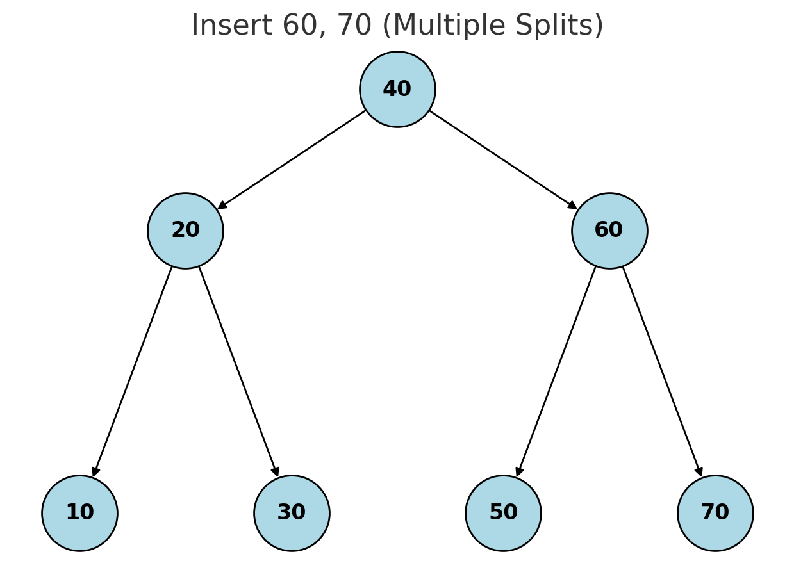

# B-Tree Basics

* Mutable Storage engines: We make changes in place to the location where the file exist. 
* Immutable Storage engines: append only 

Although some implementation of slotted pages and MVCC do have multiple version for the same key but for now let's assume there is just one key for one record in our datafiles. 

Let's see how other trees can perform if used for storage purpose. 

### Binary Search Trees
Each node splits the search space into left and right subtrees, a
node key is greater than any key stored in its left subtree and less than any key stored
in its right subtree

### Tree Balancing 
Insertion in BST do not follow any order if you keep adding nodes with high values if will keep on growing in a linear direction (not binary). So instead of getting a `log(n)`
search space it will give us a linear `O(N)` search space. That's why our storage structure needs to be balanced. 

#### Balanced Tree: 
* Height of Log(N), where N is total number of nodes in tree 
* Difference between height of two subtrees is not greater than one. 
* Without balancing we loose performance benefits of binary path split. 

>One of the ways we do tree balancing is by performing rotation step, if two insertion leave the branch unbalanced we can make rotation on the middle node and it will become the rotation pivot and will be promoted as a parent and it's previous parent will become it's right child. 


Before rotation: 
```markdown
        X
       /
      Y
     /
    Z
```

After rotation: (Right rotation abound pivot Y, we do this when left side is heavy)
```markdown
      Y
     / \
    Z   X
```

### Trees for Disk-Based Storage
Observations till now: 
1. Unbalanced tree gives worst case complexity of O(N)
2. Due to low fan-out (only two children per node), we have to perform rotation, node balancing all that. 
3. As we need to do all this on disk it increases the IO cost. 

Problems we may face: 
1. Locality: Elements gets added in random order which decreases the locality. Because of which the search among similar nodes needs a disk IO each time we found the corresponding child nodes in a new page. If the nodes have high locality there is high chance we get them all in single disk IO page fetch. 
2. Child Pointer & Tree Height: Binary tree have fan-out of 2, height of binary tree becomes log(N), This log(N) for a binary tree might look good but note that data is on disk we need to fetch the node each time from disk it will tell if we need to go on left or right child, again do a fetch and so on. Huge number of disk IO just for a simple tree traversal, this concept may look good for in memory requirements. Hence there is no build in concept of locality with binary trees on disk it's extremely expensive to have them. 

#### We want our tree to have...
1. High fan-out to improve locality of the neighboring keys. 
2. Low height to reduce the numbers of seeks during traversal. 


## Disk-Based Structures 
We prefer them when the amount of data is so large that keeping it on in-memory is not feasible. It also allows persistence for data. 

### 1. Hard Disk Drives 
These are the spinning disk. Seek operations increases cost as it needs disk rotation and mechanical head movement to do read/write head to desired location. Although reading and writing some other in that sector is realively cheap. Sector is smallest transfer unit of spinning drive. 

### 2. Solid State Drives
* No disk that spins, not moving part or head for positioning. 
* Built of memory cells --> connected as strings (32-64 cells) --> these strings are combined into arrays --> these arrays are combined into pages --> and pages combined into blocks. 
* Page size varies: 2 to 16 Kb, Blocks typically contain 64-512 pages.
  Here’s a clean 5-point version:
1. **Memory Cell** – the smallest unit (a single transistor) storing 0/1 or multiple bits.
2. **String** – 32–64 memory cells connected vertically in series.
3. **Array** – many strings placed side by side, forming a 2D grid.
4. **Page** – a horizontal row of cells across the array (smallest read/write unit).
5. **Block** – multiple pages stacked together (smallest erase unit).


**Important rules of NAND Flash or SSDs:** 
1. You can read and write in small chunks, pages. 
2. You can erase only huge chunks which are blocks. 
3. You can not overwrite the data, in SSDs you cannot change 1 to 0 or vice-vesa in an existing page. You need to erase the entire block and write same to a newer block. So when you need to update you mark that page or block **(need to check if it's always block or pages)** , mark them stale and write same thing to some newer available location.


#### Flash Translation Layer (FTL) and Garbage Collection: 
* FTL : Maps page ID to their physical location, tracking empyt, written and discarded pages. It also does garbage collection of stale or erased pages if there is some valid data in those it copies it to newer location. 
* OS have block device abstraction, when asked for a string from database it may look like just string to us but in real a whole block is fetched and then searched among those pages, this follows the concept of locality, if you required x, you may also require something near or around it in future. 


### 3. On-Disk Structures 
They are based on block based nature that we saw earlier, so in order to minimize the IO we should keep in mind following: 
1. Designing layout to improve locality. 
2. Reducing longer pointer chain lookups
3. Follow high fan-out, less height (BTree)

### B Tree
* They are made with concept of balanced binary tree but with high fan-out
* B-Trees are sorted: keys inside it are stored in sorted order. 
* Efficiently execute point (Mono) and range (Flux) based queries. 

### B Tree Hierarchy 
* Each node have upto `N` keys and `N + 1` pointers to the child nodes. 
* Root Node: top node of tree 
* Leaf Node: bottom layer with no child. 
* Internal Node: connecting leaf and root. 
* They have higher fan-out which helps to amortize the structural cost and keep tree balanced. 
* Merge and Splits: These are balancing operations which triggers when nodes are full or near empty. 

### B+ Tree 
* B+Tree allow storing values only in leaf nodes, where BTree allows to store on any level be it root, internal, leaf 
* Internal nodes only use separator keys to guide the path to leaf nodes, as leaf nodes stores the actual value. 
* B+Trees are wide-spread and used as BTree at many places. InnoDB's B+Tree implementation is mentioned as BTree only. 

### Separator Keys 
* Keys stored in BTree nodes are called separator keys, they split tree into subtrees. Inside a nodes these separator keys are sorted eg: K1, K2, K3 are sorted it becomes easy to do binary search on these for exact look-ups in Log(N) and then go to subsequent subtree. 
* In case of N separator keys we have N+1 child pointers. 
* Some BTree variants have sibling node pointers mainly at leaf level and some also have linked into both directions making kind of doubly linked list among the leaf nodes eventually helping with range queries. 

(see [1]) in `README.md`

### B-Tree Lookup Complexity ---> Log(M), M is total keys in BTree
There are two prespective of look-up complexity
* M = total number of items/keys in the entire B-Tree
* N = number of keys per node

This is not strict as not always we will have same N keys per node for a child or other. 

**1.  Block Transfers (Disk I/O Operations) (Slow Process)**
* BTrees superpower is that they are fat and short, suppose we have 1000 keys in node which points to other 1000 child nodes, this can cut down the search space by factor of 1000, as noe we know among 1000 child nodes which one is ours.
* Binary Search fanout : O(Log(N)), base 2 
* BtreeNode Fanout : O(Log(M)), base N , due to N child fanout. 


**2.  Key Comparisons (CPU Operations) (Fast Process)**
* This process is pretty fast as it includes just finding the correct separator key using binary search. 

This is the final, crucial point. We have two complexities:
1.  Disk Seeks: $log_N M$
2.  Comparisons: $log_2 M$

* For a given DB N is fixed

* So, the complexity for disk seeks ($log_N M$) is really just a **constant multiplied by** the complexity for comparisons ($log_2 M$).

In Big O notation, we drop the constants. So:
$$O(log_N M) = O\left(\frac{1}{log_2 N} \times log_2 M\right) \rightarrow O(log_2 M)$$


$$O(log_2 M) \rightarrow O(log M)$$


### BTree Lookup Algorithm 
* Will be done using the tree traversal using separator keys 
* For point queries we will look for exact match. 
* For range queries we will look for predecessor or asked key. 
* During the range scan, iteration starts from the closest found key-value pair and
  continues by following sibling pointers until the end of the range is reached or the
  range predicate is exhausted

### Counting Keys
Don't felt like much important ...may read it later 

## B-Tree Node Splits 
* Split occurs with insert and update operation, this situation is called overflow. 
* Insert: Locate target node in btree and try to insert there, if there is no space for new key there will be split on the first half. Suppose we have N nodes allowed and we try to bring one for node, so first N/2 keys will stay in that split after split the first node is promoted to parent node and if parent node also don't have space to have this new mid node, this same thing recursively propagates till root node. 
* Update: Same as insert, it's just that split happens when the new data can not fit in existing page. 
Above things are more aligned toward classic BTree not B+Tree which stores key in leaf nodes. 
* Root node can also get split if there are multiple nodes getting promoted, this promotion can lead to increase the height in BTree. 

Steps to do node split: 
1. Allocate a new node.
2. Copy half the elements from the splitting node to the new one.
3. Place the new element into the corresponding node.
4. At the parent of the split node, add a separator key and a pointer to the new
   node.



## B-Tree Node Merges
* Node merges happen while deletion. 
* If nodes have too few values, below threshold in that case sibling nodes are merged. 
* This situation is called underflow.
* Two nodes are merged in following conditions:
1. For leaf nodes: If a node can store N key-value pairs and combined sum of neighbouring nodes is less than equal to N
2. For non leaf nodes: Same for non leaf with N+1 condition. 

Steps to do for node merges 

1. Copy all elements from the right node to the left one.
2. Remove the right node pointer from the parent (or demote it in the case of a non‐
   leaf merge).
3. Remove the right node

In order to reduce the split and merges there is technique called  `Rebalancing`  which we will see in Chapter 4.