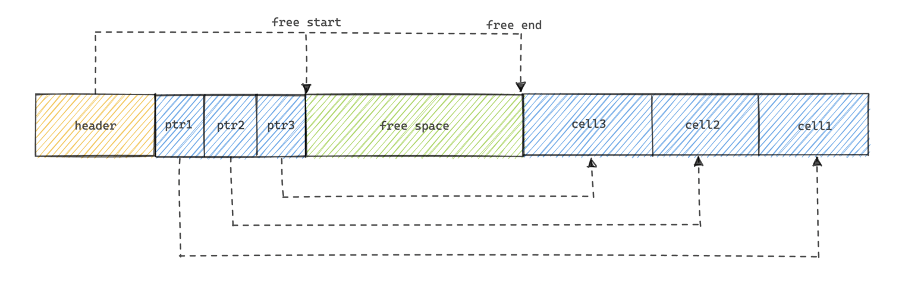

# File Formats 

* Main memory in general are kind of transparent due to virtual memory and we don't need to manage the offsets of them. 
* Whereas the disks are accessed using systems calls and specify the offset inside the target file and interpret into suitable form for main memory.
* There are many impl to BTrees, basics reamain same like split, merge, but they are not sufficient for a full-fledged implementation there is much more to it. 
* The Complexity with on disk BTrees comes due to the mutability they have to provide. 

* Creating file format for our use case is very similar to creating data structures in languages with unmanaged memory model. We do malloc and all garbage collection handling. 
* But in the case of disk, we have to do fragmentation on our own we can't assume everything to be contiguous. Handling fragmentation is hard. 


## Binary Encoding 

* In order to store the data efficiently, we need to store data in a format which can be serialized and deserialized easily and also encode to binary format for compact size. 
* **Layout**: A layout is essentially the blueprint of how data is arranged in bytes on disk (or in a file, page, or message).
* Unlike programming languages on RAM provides `malloc` and `free` calls, for disk we just have `read` and `write`. So we just have read write as option and has to be done efficiently. 
* Databases usually divide files into pages (fixed-size blocks, like 4 KB). A page layout describes how records (rows of data) are stored inside one page.


### Primitive Types

* To store data or send it over a network, we must convert it into a sequence of raw bytes (serialization).

* For multi-byte numbers (like int or long), the endianness (byte order) must be consistent. A Big-Endian system will store bytes in a different order than a Little-Endian system, and software must handle this to avoid errors.
* Big Endian reads large MSB from left to right, and vice versa for Little Endian. MSB is nothing but contribution to the number in case of decimal 2004, 2 is MSB. 
* So while reading and writing, the endian used under hood needs to have a look. 

* For decimal numbers (float or double), computers use a standard format (IEEE 754) that acts like binary scientific notation, storing a sign, an exponent, and a fraction. This is often an approximation of the true value.

### Strings and Variable-Size Data
This section simply explained how we store the strings in binary form or in computers. 
* One way is using `UCSD String` or `Pascal String`. Here we store the size of string and data of string in bytes. 
```text
String
{
 size uint_16
 data byte[size]
}
```
* Above approach is helpful for constant time string length lookup. 
* Another way is also with **null-terminated strings**, where we keep on consume each single byte until the end of bytes come. So finding length in this case is time-consuming.
* 

### Bit-Packed Data: Booleans, Enums, and Flags
* Rather than using a whole byte (8 bits) to store the boolean we can just store it in a single bit, as we just need to know if it's 0 or 1. 
* Enums are other things with giving names to low cardinality values, internally they have a number assigned but for meaningful representation they have a string attached to them. 
* **Flags: Tracking Multiple On/Off Options**: I found this as most complex.
  Flags use the "packed booleans" idea. Each bit in a byte (or a larger integer) represents a different option. If the bit is 1 ("set"), the option is on. If it's 0, it's off.

```text
The Power-of-Two Rule
To make sure each option has its own unique bit, we assign them values that are powers of two.

Look at these numbers in binary:

IS_LEAF_MASK = 1 = 00000001 (Controls the 1st bit)

VARIABLE_SIZE_VALUES = 2 = 00000010 (Controls the 2nd bit)

HAS_OVERFLOW_PAGES = 4 = 00000100 (Controls the 3rd bit)
```
Hence, combining all the flags won't interfere with each other. We can't use a enum here as it will give just one type of flag. 


## General Principles

#### **Overall Structure**
A well-organized file is structured like a book for efficient access.

* **Header**: A section at the **beginning** of the file. It's the "table of contents," containing metadata like the file type, version, and pointers to main data sections.
* **Pages**: The main content of the file is divided into **fixed-size blocks** called pages. This makes it extremely fast to navigate to any part of the file without scanning from the start.
* **Trailer**: A section at the **end** of the file. It's the "index," often containing summary information or a **checksum** to verify that the file has not been corrupted.

#### **Record Structure (Inside a Page)**
* **Fixed Schema**: A predefined layout for records that saves space by not repeatedly storing field names. The program knows the `employee_id` is always the first 4 bytes.
* **Variable-Size Fields**: To handle fields of varying lengths (like names), the common strategy is to place all fixed-size data first. This fixed-size block includes the **lengths** (of those variable data) or, even better, the direct **offsets** (starting positions) of the variable-size fields that follow. This allows for direct, fast access to any field.

This creates a clear hierarchy: **Primitives** make up **Fields** → Fields make up **Records** → Records are stored in **Pages** → Pages, along with a Header and Trailer, make up the final **File**.


## Page Structure
* Data files and indexed files are stored in disk file and these files are divided into fixed sized pages or like 4 to 16 Kb. 
* Leaf nodes of BTree have keys and data records, whereas internal nodes have keys and pointer to next nodes. 
* This mainly works for fixed size data and need to do shifting if the data does not fit into the page. 


## Slotted Pages

We need a page format which let us: 
1. Store variable size records with a minimal overhead. Because making fixed size segement inside the page if good for fixed size data but not good for variable or very small sized data. 
2. Reclaim the space occupied by the removed records. 
3. Reference record in the page without regard to their exact location (slotted array will help us in this). 

**Traditional (naïve) Page Layout**

You could just line up records one after another in the page.

**Problem**:
* If records vary in size (e.g., VARCHAR), you can’t easily update them.
* Deletion leaves gaps → fragmentation.
* Moving rows around breaks references (like indexes pointing into the page).


---
* We organize page into collection of slots. These slots store the pointer to the records. So for data ordering just change the order in slotted array. 
* In case of deletion nullify the value in slotted array. 




**_Remember_**: When the page is full we do classic page splits and that's where the records are phyically moved from one page to newly created page. Remember that child splits and moves to parent. 

* "Sorted data" means the slot directory entries are ordered by key.
* The physical offsets where the records sit in the page body may not be sorted at all — they’re just wherever they were inserted and fit.


* How Slotted Pages helped us ? 

We now just need to make sure if offsets in slotted array are correctly placed. Space reclamation by defragmentation and rewriting to page. Exact location of the record is local to page but offset in slotted array are sorted. 


the traditional approach forces an immediate, expensive "compaction" on every single deletion because it lacks the indirection of a slot array. The slotted page's main advantage is providing that indirection due to the offsets maintained in the slotted array. 


### Cell Layout
* Page: The unit of I/O which is of fixed size. It have a PageHeader, slotted array, cells, data inside cells. 
* Cell: Single logical unit where data is stored, it kind of represents single complete record. 
* Slot: This connects page to cells, and contains the pointers to the cell which are located in that page. 

Cells within page are uniform it means in a single page either we can have the key - pointer cells, or key -value type cells. As in a BTree internal nodes are key - pointer type and leaf are of key - value type. 
* So internal pages are for direction 
* Leaf pages are for actual data records. 

#### Key-Cell Layout 
* For internal BTree Page cells. 
* 3rd things here key is that separator key. 
```text
+----------------+---------------+-------------+
| [int] key_size | [int] page_id | [bytes] key |
+----------------+---------------+-------------+
```

#### Key-Value Cell Layout 
* First flag can be used as tombstone deletion. 
* Other are same for key, value size and actual key data_record bytes. 
```text
+--------------+----------------+------------------+--------------------+----------------------+
| [byte] flags | [int] key_size | [int] value_size | [bytes] key        | [bytes] data_record  |
+--------------+----------------+------------------+--------------------+----------------------+
```

* Variable size data can easily be accessed due to the byte sizes we are storing we can easily skip on bytes and go to exact location. 

* _**The Power of Indirection (Slotted Pages):**_ The true benefit of the Page/Slot/Cell design is the decoupling of logical order from physical order. The slots in the directory are kept sorted by key, which allows for fast binary searching. The cells themselves, however, can be stored anywhere in the page's free space, generally sequential append for fast insertion. This makes insertions cheap: just append the new cell to the free space at the end of the page and add a new sorted pointer to the slot directory. This avoids the O(N) cost of shifting data on every write.


* **_Fragmentation:**_ The downside of this design is internal fragmentation. When you delete or update records, you leave behind "holes" of unusable space in the cell data area. Over time, a page can become mostly empty but still be unable to fit a new, larger record because the free space is not contiguous. Database systems require maintenance processes (like PostgreSQL's VACUUM) to periodically rebuild pages and reclaim this fragmented space.

* _**Handling Large Objects (TOAST):**_ What if a single data_record (e.g., a JSON document, a blog post) is larger than 8KB? It can't fit in a single cell on a single page. In this case, the cell layout would change. Instead of storing the data record directly, the cell would store a pointer to a linked list of special overflow pages that hold the large data. This technique is often called TOAST (The Oversized-Attribute Storage Technique). The flags byte in the cell header is a perfect place to put a bit that says "this value is toasted".


## Managing Variable Size Data
* Removing items from page does not needs to remove actual cell and shift other cells, instead we can mark that cell as deleted in slotted arraya and maintain a availability list which says this is start of the fragmented space available. 
* These unoccupied segments are also called as `freeblocks` in SQLite. 


There are mainly two algos which decide in which fragmented space new data should go: 
1. **First fit:** Searches for the first available segement greater than or equal to the required size of the incoming data. Hence this algo can lead to creation of many small, unusable free blocks at the beginning of memory, a condition known as external fragmentation. 


2. **Best fit:** : The best fit algorithm searches through all the available free blocks and allocates the one that is the smallest but still large enough to hold the process.

| Feature | First Fit | Best Fit |
| :--- | :--- | :--- |
| **Speed** | Fast | Slow |
| **Search** | Stops at the first suitable block | Scans all available blocks |
| **Fragmentation** | Can create large leftover blocks | Tends to create very small leftover blocks |
| **Goal** | Quick allocation | Minimize wasted space in the chosen block |


## Versioning
Database file formats change over time due to new features, bug fixes, and performance improvements. Storage engines must support multiple file format versions for backward compatibility.

###  Version Identification Methods

1.  **Version Prefixes in Filenames:**
  * **Example:** Apache Cassandra uses prefixes in its data file names (e.g., `na-` for version 4.0, `ma-` for version 3.0).
  * **Advantage:** The version can be determined without opening the file.

2.  **Separate Version File:**
  * **Example:** PostgreSQL stores the version number in a file named `PG_VERSION`.

3.  **In-File Header:**
  * **Method:** The version is stored directly in the index file header.
  * **Requirement:** A portion of the header must have a stable format across versions to be read first.
  * **Magic Numbers:** Some formats use "magic numbers" (unique byte sequences) at the beginning of the file to identify the version.

## Checksumming
Before writing the data on disk, we compute its checksum and write it together with
the data. When reading it back, we compute the checksum again and compare it with
the written one. If there’s a checksum mismatch, we know that corruption has occur‐
red and we should not use the data that was read.

Since computing a checksum over the whole file is often impractical and it is unlikely
we’re going to read the entire content every time we access it, page checksums are
usually computed on pages and placed in the page header. This way, checksums can
be more robust (since they are performed on a small subset of the data), and the
whole file doesn’t have to be discarded if corruption is contained in a single page.